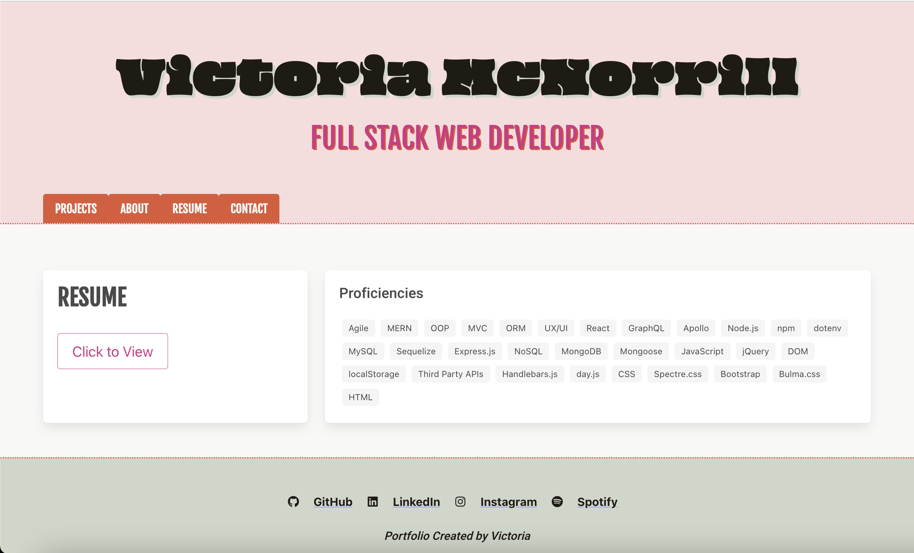

# React-Portfolio

## Description
My tech portfolio is a dynamic personal portfolio application built with React and designed to showcase my web development skills to potential employers. It offers seamless navigation, project displays, and a user-friendly interface for potential employers.

## Table of Contents
- [React-Portfolio](#React-Portfolio)
  - [Description](#description)
  - [Table of Contents](#table-of-contents)
  - [Links](#links)
  - [Preview](#preview)
  - [License](#license)
  - [Credits](#credits)
    - [Framework Documentation](#framework-documentation)
    - [Tutorials](#tutorials)
    - [Example Code](#example-code)
  - [Badges](#badges)
    - [Frameworks and Libraries](#frameworks-and-libraries)
    - [Integrated Development Environments (IDE)](#untegrated-development-environments-ide)
    - [Languages](#languages)
## Links

[Deployed Site](https://victoriamcn.github.io/React-Portfolio/#about)

[GitHub Repository](https://github.com/victoriamcn/React-Portfolio)

## Preview

## License

- [Click here](https://opensource.org/license/apache-2-0/) to view the license documentation or,
- Go to the [license file](https://github.com/victoriamcn/React-Portfolio/blob/main/LICENSE) with in this repository.

## Credits

### Framework Documentation
[React](https://react.dev/learn/react-developer-tools) 

### Tutorials

- Digital Ocean: [Introduction to Bulma CSS with React](https://www.digitalocean.com/community/tutorials/react-intro-react-bulma-components)
- dev: [Using the useState Hook and Working with Forms in React.js.](https://dev.to/heyjoshlee/using-the-usestate-hook-and-working-with-forms-in-react-js-m6b)
- freeCodeCamp: [How to Build Forms in React](https://www.freecodecamp.org/news/how-to-build-forms-in-react/)
- Medium: [Building React Forms With useState](https://medium.com/@aaron_schuyler/building-react-forms-with-usestate-2cf45a3110ac)
- Medium: [How to use HTML5 form validations with React](https://codeburst.io/how-to-use-html5-form-validations-with-react-4052eda9a1d4)
- mailtrap: [Building Contact Form and Handling Emails with React](https://mailtrap.io/blog/react-contact-form/)
- mailtrap: [How to Validate Emails in React](https://mailtrap.io/blog/validate-emails-in-react/)
- One Complier: [Element type is invalid: expected a string (for built-in components) or a class/function (for composite components) but got: undefined](https://onecompiler.com/questions/3tjhj2ytk/element-type-is-invalid-expected-a-string-for-built-in-components-or-a-class-function-for-composite-components-but-got-undefined-you-likely-forgot-to-export-your-component-from-the-file-it-s-defined-in-or-you-might-have-mixed-up-default-and-named-imports)
- StackOverflow: [How do I add validation to the form in my React component?](https://stackoverflow.com/questions/41296668/how-do-i-add-validation-to-the-form-in-my-react-component)
- StackOverflow: [map function not working in React](https://stackoverflow.com/questions/39999671/map-function-not-working-in-react)
- StackOverflow: [React pdf onclick download](https://stackoverflow.com/questions/50964445/react-pdf-onclick-download)
- StackOverflow: [React site warning: The href attribute requires a valid address. Provide a valid, navigable address as the href value jsx-a11y/anchor-is-valid](https://stackoverflow.com/questions/52801051/react-site-warning-the-href-attribute-requires-a-valid-address-provide-a-valid)
- StackOverflow: [Rendering an array.map() in React](https://stackoverflow.com/questions/38282997/rendering-an-array-map-in-react)
- StackOverflow: [Webpack successfully compiled but does not show output in browser](https://stackoverflow.com/questions/44515434/webpack-successfully-compiled-but-does-not-show-output-in-browser)

### Example Code

- GitHub: [Lemming97](https://github.com/Lemming97/React_Portfolio/blob/main/src/components/Contact/index.js)
- GitHub: [EmilyNecciai](https://github.com/EmilyNecciai/react-portfolio/blob/main/src/components/Contact.js)

## Badges

### Frameworks and Libraries

### Integrated Development Environments (IDE)

### Languages

